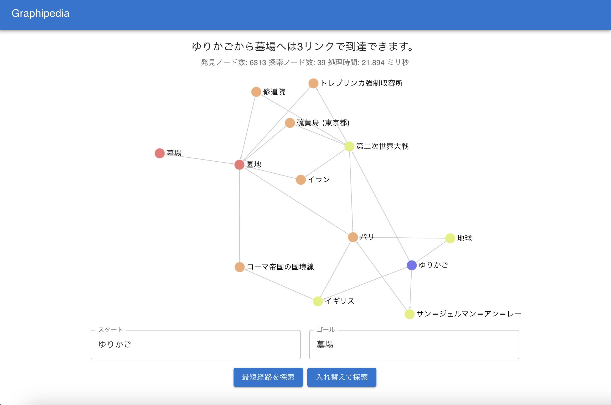

## profile

- Name: YarmUI
- Mail: [yarmui.gi@gmail.com](mailto:yarmui.gi@gmail.com)
- Twitter: [YarmUI](https://x.com/YarmUI)
- Github: [YarmUI](https://github.com/YarmUI)

## Service

### Graphipedia（工事中）

Wikipediaの二記事間のリンクをたどり、最短経路をグラフ構造として可視化するサイト

Rust言語とTypeScriptの習作

- Site: <del><a href="https://graphipedia.dog-right.dev">https://graphipedia.dog-right.dev</a></del>
- Source: <del><a href="https://github.com/YarmUI/graphipedia">https://github.com/YarmUI/graphipedia</a></del>

### Momotube

ブルーアーカイブの二次創作として、ヘイローをAR合成するiOSアプリです。

- App Store: [Momotube](https://apps.apple.com/jp/app/momotube/id6756948916)

<blockquote class="twitter-tweet" data-lang="ja">
  <a href="https://twitter.com/YarmUI/status/2086819522032599417">Momotubeの紹介ツイートを見る</a>
</blockquote>

